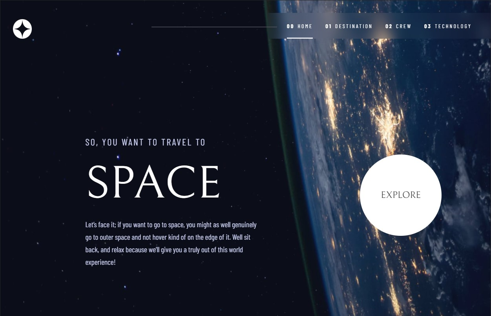

# Space tourism Website - Practice Redux and Testing Library

This is a project to practice and learn [Redux](https://redux.js.org/) using [Vite](https://vitejs.dev/) and implement testing using [Testing Library](https://testing-library.com/) and [Vitest](https://vitest.dev/). 

## Table of contents

- [Overview](#overview)
  - [The challenge](#the-challenge)
  - [Screenshot](#screenshot)
  - [Links](#links)
- [My process](#my-process)
  - [Built with](#built-with)
  - [What I learned](#what-i-learned)
- [Author](#author)

## Overview

### The challenge

Users should be able to:

- View the optimal layout for each of the website's pages depending on their device's screen size
- See hover states for all interactive elements on the page
- View each page and be able to toggle between the tabs to see new information

### Screenshot




## My process

### Built with

- [Vite](https://vitejs.dev/)
- [React](https://reactjs.org/) - JS library
- [Tailwind Css](https://tailwindcss.com/) - CSS framework
- [Redux](https://redux.js.org/) - For State Management
- [Vitest](https://vitest.dev/) - Unit test framework 
- [Testing Library](https://testing-library.com/) - Testing Library 
- [Back-End API](https://github.com/HpatricioH/space-tourism-back-end)
- Semantic HTML5 markup
- Mobile-first approach
- Responsive Design 


### What I learned

With this project I was able to learn and implement Redux and Testing Library. Also, I was able to use vite which was one of my new tools to use. However, the most important thing is that I had the opportunity to implement a test using Testing Library and Vitest, along with this process I had to learn how to test a redux component. 

### html

```html
<picture>
  <source type='image/jpg' srcSet={tech.imgportrait} media='(min-width: 1024px)' />
  
</picture>
```
### Testing Library
``` js - Testing Library 
export const destinationsSlice = createSlice({
  name: 'destinations',
  initialState: {
    data: []
  },
  reducers: {
    getDestinations: (state, action) => {
      state.data = [action.payload]
    }
  }
})
  
export const getDestinationsAsync = (id) => async (dispatch) => {
  try {
    const response = await axios.get(`${API_URL}/${parseInt(id)}`)
    dispatch(getDestinations(response.data[0]))
  } catch (error) {
    console.log(error)
  }
}
```
### Redux Component 
``` js
export const TechnologyPage = () => {
  const techData = useSelector(showTech)
  const dispatch = useDispatch()
  const { id } = useParams()

  useEffect(() => {
    dispatch(getTechAsync(id))
  }, [id])

  return (

```

## Author

- LinkedIn - [Patricio Huerta](https://linkedin.com/in/patricio-huerta)
- [Twitter](https://twitter.com/pato_huerta)


